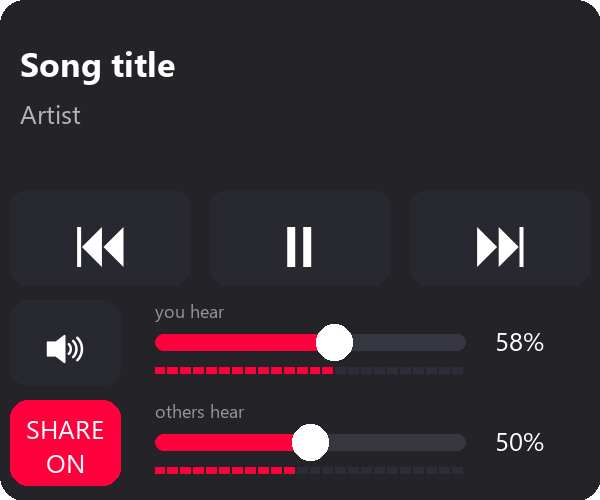

# VrMC

VR media controls.

A SteamVR overlay that puts music controls on your wrist: now playing, previous / play-pause / next,
a volume slider for the music app only, and an optional **SHARE** switch that lets people in VRChat
hear your music (mixed under your voice) at a level you choose.

Made for YouTube Music in a browser, but it works with any app that shows up in the Windows media
controls (the popup you get from the keyboard volume keys).

## Requirements

- Windows 10 2004+ or Windows 11 (music sharing uses per-app audio capture)
- SteamVR
- Python 3.12+ and `pip install -r requirements.txt`
- For SHARE: the **Steam Streaming Microphone** device (installed with Steam)

## Run

Start SteamVR, then double-click `run.bat` (or `pythonw wrist_media.py`).
The first run registers it with SteamVR so it starts automatically with SteamVR after that
(turn off in SteamVR Settings → Startup/Shutdown → Choose Startup Overlay Apps).

## Use

The panel sits on your **left** wrist. Touch it with the tip of your right controller
(or laser-click it while the SteamVR dashboard is open).

| Control | What it does |
| --- | --- |
| ⏮ ⏯ ⏭ | previous / play-pause / next |
| 🔊 + **you hear** slider | mute / volume of the music app only (not your headset, not VRChat) |
| **SHARE** + **others hear** slider | send your music into your VRChat mic; slider sets how loud it is for others |

Both sliders use a perceptual curve: 50% sounds about half as loud. They're independent: changing
what you hear doesn't change what others hear. The bars under each slider show the live level.

### Letting people hear your music (SHARE)

1. In VRChat → Settings → Audio, set **Microphone** to **Steam Streaming Microphone**
   and turn **noise suppression off** (it treats music as noise).
2. Tap **SHARE** on the panel. It is off every time the panel starts.

Your voice is then routed through this program: if it isn't running, VRChat hears nothing
(switch VRChat back to your normal mic). Sharing copies *everything* the music app plays,
e.g. other browser tabs.

## Settings

Double-click `run_settings.bat` for a settings window: which wrist, panel size / position / tilt,
touch sensitivity, which mic to mix into VRChat, and the starting "others hear" level. Changes are
saved to `settings.json` and the running panel applies them within a second.
Clicks, touches and audio events are logged to `%TEMP%\wrist_media.log`.

## Known issues

- Touching the title / album-art area also triggers the transport buttons.
- SHARE shows ON even when audio capture has failed; nothing on the panel shows the error.
- Pear Desktop is not matched for sharing.

## License

Public domain ([Unlicense](LICENSE)).
